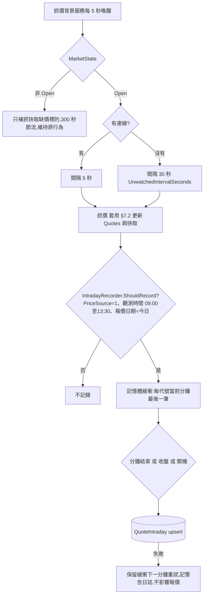
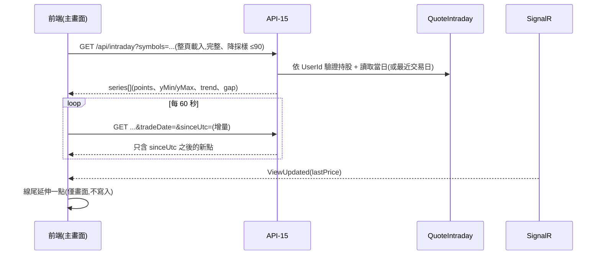
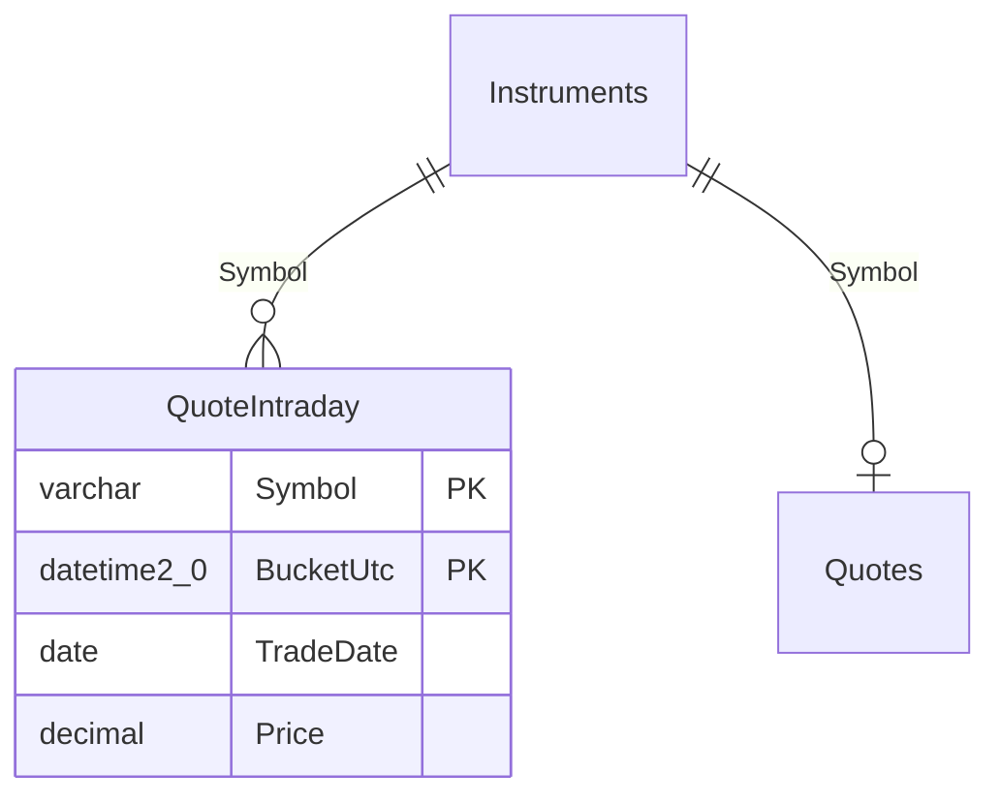

# SA 規格交付文件:FR-26 當日即時線圖

- 對應 SPEC:v1.4 升為 v1.5
- 狀態:使用者已「確認規格」(Q1 至 Q14 全數決定,其中 Q3 為使用者改變、其餘採 SA 建議預設)
- **編號檢查(2026-10-08)**:`SPEC.md` 與 `docs/` 內已使用的 FR 最大編號為 FR-25(`docs/sa/` 只有 FR-25 一份);FR-26 未被占用,故沿用 **FR-26**。API 現有最大編號為 API-14(另有 API-20 至 API-24、API-30),本功能新增 **API-15**,避開 API-13、API-14。SEC 最大編號為 SEC-24,本功能不新增 SEC 編號(沿用 SEC-08、SEC-13、SEC-17)。
- 範圍:持股清單每個代號顯示「當日(盤中)即時走勢」,每列迷你圖、點開展開大圖;走勢由伺服器自行記錄報價形成,不依賴 MIS 歷史分時 API(Q-08 僅實測、不阻擋)。

## 1. 功能目的

使用者在主畫面(`/`)看到每檔持股的當日走勢:一眼判斷漲跌趨勢,點開看較大的圖、最高、最低與昨收參考線。報價由既有抓價服務取得,新增「盤中持續記錄」,即使沒人開頁面也不斷線。

### 1.1 使用者決定(Q1 至 Q14)

| 編號 | 決定 |
| --- | --- |
| Q1 | 記憶體緩衝(每代號只留當前分鐘最後一筆觀測)+ 每分鐘 flush 1 分鐘解析度到資料庫 |
| Q2 | 保留 7 天(日曆天) |
| **Q3(改變)** | 盤中(`MarketState = Open`)**不論有沒有人看都持續抓價並記錄**;沒人看時間隔 `Quote:UnwatchedIntervalSeconds` = **30 秒**(新設定鍵,取代「盤中沒人看 300 秒」);有人看維持 `Quote:ActiveIntervalSeconds` = 5 秒。非開盤時段(只補抓快取缺價的標的、`Quote:IdleIntervalSeconds` 300 秒節流)**維持不變** |
| Q4 | 自繪 SVG,不引入圖表函式庫 |
| Q5 | 每列迷你圖,點開展開大圖 |
| Q6 | 盤後保留當日;休市日顯示最近交易日並標示日期 |
| Q7 | 只記 `PriceSource = 1` 且 09:00 至 13:30(Taipei)的點;盤前、`pz`(試撮)、`y`(昨收)不畫,無資料顯示「尚無成交」 |
| Q8 | MIS 歷史分時 API 是否存在:實測但不阻擋(`docs/verify-notes.md` Q-08) |
| Q9 | 伺服器降採樣至 ≤ 90 點;前端每 60 秒增量輪詢;線尾隨 `ViewUpdated` 延伸 |
| Q10 | 放寬「前端不運算」,**僅限繪圖座標映射** |
| Q11 | 每個代號一張圖(合併列也只有一張) |
| Q12 | 不畫成本線 |
| Q13 | 只對使用者持股內的代號提供資料,否則 404 |
| Q14 | 走勢載入或記錄失敗只影響圖區,不影響報價、損益、合計與其他功能 |

### 1.2 與既有規格的衝突與處理(SPEC v1.5 已同步修改)

| 既有條文 | 衝突 | 處理 |
| --- | --- | --- |
| §0 第 5 點、§12.5「前端不做任何運算」 | 繪圖需把價格、時間映射成座標 | 新增唯一例外:座標映射(線性縮放,見 §6),任何顯示用數字(價格、最高、最低、趨勢方向)仍由伺服器提供 |
| §2.2「K 線圖」為非目標 | 本功能是當日分時折線,不是 K 線 | 非目標保留 K 線;新增邊界說明(只做當日/最近交易日分時線,不做多日、技術指標、縮放、歷史區間、補歷史資料) |
| §7.3 沒人看 300 秒、§7.4 stale 門檻 `Idle + Stale` | Q3 改為盤中持續 30 秒 | §7.3 改寫;§7.4 門檻改為 `UnwatchedIntervalSeconds + StaleSeconds`(預設 210 秒);`IdleIntervalSeconds` 只用於非開盤補抓 |
| §16.2 | 新增限制 | 補充 |

## 2. 流程







## 3. MSSQL 資料表異動(Schema)

只新增 1 張表,不改動既有資料表與欄位。

```sql
CREATE TABLE dbo.QuoteIntraday (   -- 當日分時走勢,1 分鐘解析度;只存公開報價,不含使用者資料
  Symbol    varchar(10)   NOT NULL,
  BucketUtc datetime2(0)  NOT NULL,   -- 觀測時間(本系統抓到該價的時間,FetchedAtUtc)截到分鐘,UTC,秒為 0
  TradeDate date          NOT NULL,   -- BucketUtc 換算 Taipei 時間的日期
  Price     decimal(12,4) NOT NULL CONSTRAINT CK_QuoteIntraday_Price CHECK (Price > 0),  -- 該分鐘最後一筆成交價觀測值(PriceSource = 1)
  CONSTRAINT PK_QuoteIntraday PRIMARY KEY (Symbol, BucketUtc),
  CONSTRAINT FK_QuoteIntraday_Instruments FOREIGN KEY (Symbol) REFERENCES dbo.Instruments (Symbol)
);
CREATE INDEX IX_QuoteIntraday_TradeDate ON dbo.QuoteIntraday (TradeDate);   -- 保留期清理用
```

| 欄位 | 型別 | 可 NULL | 說明 |
| --- | --- | --- | --- |
| `Symbol` | `varchar(10)` | 否 | PK 之一,FK → `Instruments.Symbol` |
| `BucketUtc` | `datetime2(0)` | 否 | PK 之一;分鐘桶(UTC),以**觀測時間**分桶,不是 `tlong`(`tlong` 是最後成交時間,冷門股會長時間不動,用它分桶會讓線尾中斷) |
| `TradeDate` | `date` | 否 | Taipei 日期,查「最近交易日」與清理用 |
| `Price` | `decimal(12,4)` | 否 | 與 `Quotes.LastPrice` 同精度,不捨入 |

- 主鍵 (`Symbol`, `BucketUtc`) 同時支援「單一代號依時間範圍讀取」與「取最近一筆」,不另建索引。
- 預估資料量:200 檔 × 271 分鐘 × 7 天 ≈ 38 萬列,可忽略。
- 寫入規則:同分鐘重複寫入 = 覆蓋(upsert,後者勝)。**不寫「補值」列**:抓價中斷造成的缺口就是缺口(見 §6 `gap`)。
- 保留:`Intraday:RetentionDays`(7)。每日 07:00 的定期工作(§7.7)之後刪除 `TradeDate < 今日(Taipei) − 7 天` 的列,分批 `DELETE TOP (5000)` 迴圈,失敗只記日誌。
- **Migration 須人工執行**:EF Core Migration 名稱 `AddQuoteIntraday`;網站 SQL 登入沒有 DDL 權限,網站啟動時不得自動遷移(SEC-16)。部署順序見 §9。

## 4. 設定鍵異動

| 設定鍵 | 預設值 | 說明 |
| --- | --- | --- |
| `Quote:UnwatchedIntervalSeconds`(新) | 30 | 盤中(`Open`)沒有未暫停連線時的抓取間隔;允許範圍 `ActiveIntervalSeconds` 至 300,超出範圍啟動時回報設定錯誤並使用預設 |
| `Quote:IdleIntervalSeconds`(改說明) | 300 | **只用於非開盤時段**補抓快取缺價標的的節流;不再用於盤中,也不再參與 stale 門檻 |
| `Intraday:Enabled`(新) | `true` | `false` 時不記錄、API-15 回 503 `FEATURE_DISABLED`、前端不顯示圖區 |
| `Intraday:RecordStartTime`、`Intraday:RecordEndTime`(新) | `09:00`、`13:30` | 記錄時段(Taipei,含頭尾分鐘;秒數以 13:30:59 為上限) |
| `Intraday:RetentionDays`(新) | 7 | 保留天數 |
| `Intraday:MaxPoints`(新) | 90 | 完整查詢時降採樣的點數上限 |
| `Intraday:GapBreakSeconds`(新) | 180 | 相鄰兩點間隔超過此值,後一點標 `gap = true`(前端不連線) |
| `Intraday:FlushSeconds`(新) | 60 | 緩衝寫入資料庫週期(對齊分鐘邊界) |
| `Intraday:MaxRequestsPerMinute`(新) | 30 | API-15 每位使用者每分鐘請求上限,超過回 429 |

不新增任何機敏設定(沒有 **(env)** 項目)。

## 5. 後端規則

### 5.1 抓價排程(取代 SPEC §7.3 的間隔邏輯)

```
每 Quote:ActiveIntervalSeconds(5 秒)喚醒一次:
  state = MarketCalendar.GetState(nowTaipei)
  若 state 改變 → 推播 MarketStatus
  若 state != Open → 只補抓快取沒有價格的標的(300 秒節流;RequestImmediateFetch 不受限)  # 行為不變
  否則(Open):
    active = 未 Pause 的 SignalR 連線數
    interval = active > 0 ? Quote:ActiveIntervalSeconds : Quote:UnwatchedIntervalSeconds
    若 距上次抓取 < interval → 結束本輪
    其餘(失敗退避、symbols 查詢、批次、速率限制、套用)不變
```

### 5.2 MIS 請求量與封鎖風險取捨

| 情境(假設 60 檔不重複代號 = 2 批) | 每日請求數(08:30 至 14:35,365 分鐘) |
| --- | --- |
| v1.4 沒人看(300 秒) | 約 73 輪 × 2 = 146 |
| **v1.5 沒人看(30 秒)** | 約 730 輪 × 2 = 1,460(約為舊值 10 倍) |
| 有人看(5 秒,既有行為) | 受速率限制器約束,上限約 4,380 輪 |

- 平均約 0.07 次請求/秒,遠低於 Q-01 實測「300 毫秒間隔連續 10 次皆成功」與 `Quote:MaxRequestsPer5s = 3` 的上限;沒人看時的負載約為有人看時的 1/6。
- 風險:MIS 無正式服務保證(§16.2);長時間規律請求有被限流或封鎖的可能,實際門檻未知。緩解:沿用速率限制器與失敗退避(連續失敗 3 次拉長間隔);任何非 JSON、HTML 錯誤頁、非 2xx 一律視為失敗;若發生封鎖跡象,把 `Quote:UnwatchedIntervalSeconds` 調大(上限 300)或設 `Intraday:Enabled=false` 即可退回舊負載,不需改程式。
- 取捨:30 秒間隔使沒人看時的走勢解析度約 2 點/分鐘,以 1 分鐘桶記錄剛好足夠;再縮短只會增加請求、不提升圖形品質。

### 5.3 記錄規則(`IntradayRecorder`,位於 `StockInventory.Quotes`)

每次「套用報價」成功後呼叫 `Record(symbol, price, priceSource, quoteTimeUtc, fetchedAtUtc)`,**全部符合**才進緩衝:

| 條件 | 說明 |
| --- | --- |
| `Intraday:Enabled = true` | |
| `PriceSource = 1` | 只記成交價;`pz`(2)、買賣中間價(2)、`y`(3)一律不記 |
| `MarketState = Open` | 休市日、盤外不記 |
| `fetchedAtUtc` 換算 Taipei 時間 ∈ [09:00:00, 13:30:59] | 盤前 08:30 至 09:00 與收盤後不記 |
| `quoteTimeUtc` 的 Taipei 日期 = 今日(Taipei);`quoteTimeUtc` 為 null 時視為不符合 | 防止開盤初期 MIS 殘留前一日價格被當成今日走勢 |
| `symbol` 屬於目前 `Holdings` 的不重複代號 | 沒人持有就不記(抓價本來就只抓持股代號) |

- **緩衝**:`ConcurrentDictionary<string, (DateTime BucketUtc, decimal Price)>`,每代號只留「當前分鐘最後一筆」;同分鐘後到者覆蓋;進入下一分鐘時,把上一分鐘的項目移入待寫佇列。
- **flush**:每 `Intraday:FlushSeconds` 對齊分鐘邊界後數秒執行,待寫佇列一次批次 upsert 到 `QuoteIntraday`(單一交易)。收盤(13:31)與網站正常關閉時,額外 flush 當前分鐘。
- **upsert 實作須可在 InMemory 測試**:以 EF Core 邏輯「先查既有 PK、存在則更新、不存在則新增」實作(不使用 T-SQL `MERGE` 原生 SQL),PK 衝突(併發)時重試一次改為更新。
- **失敗處理**:flush 失敗只記一則警告日誌(同一原因 10 分鐘內不重複),待寫佇列保留並於下一次重試;佇列上限 `symbols × 15 分鐘`,超過丟棄最舊者;**絕不讓記錄失敗影響報價更新、SignalR 推播或其他 API**(Q14)。
- 網站重啟或回收會丟失尚未 flush 的最多 1 分鐘資料,視為可接受(§16.2)。
- 日誌不得出現持股成本、股數,也不記錄「哪位使用者持有哪個代號」;紀錄器日誌只寫筆數與耗時。

### 5.4 顯示日(`tradeDate`)選擇

| 條件(Taipei 現在) | 顯示日 | `isToday` |
| --- | --- | --- |
| `MarketState` 為 `Open` 或 `Closed`(平日、非休市日) | 今日 | `true`;今日尚無點(盤前、剛開盤、無成交)→ `status = noData` |
| `MarketState = Holiday` | 該代號在 `QuoteIntraday` 的最近一筆 `TradeDate`(限保留期內);沒有則 `status = noData`、`tradeDate = null` | `false` |

盤後保留當日(`Closed` 時仍顯示今日整天的線,到隔日的第一個平日 00:00 才換日)。

## 6. API 定義

通則沿用 SPEC §8:`/api` 前綴、camelCase、UTC ISO 8601 加 `Z`、需登入(未登入 401)、`UserId` 只取自登入身分、錯誤格式 §10.2。此為 `GET`,不需 CSRF。

### 6.1 API-15 `GET /api/intraday`

用途:讀取一或多個持股代號的當日(或最近交易日)分時走勢;迷你圖與大圖共用同一份資料。

**Input(查詢參數)**

| 參數 | 型別 | 必填 | 規則 |
| --- | --- | --- | --- |
| `symbols` | `string`(逗號分隔) | 是 | 去除空白、轉大寫、去重;1 至 50 個,每個 1 至 10 字元(`[0-9A-Z]`);**每個代號都必須存在於目前使用者任一庫存的持股**,只要有一個不是,整個請求回 404 `NOT_FOUND`(不透露是不存在或屬於他人) |
| `tradeDate` | `string`(`yyyy-MM-dd`) | 否 | 增量用:前端上次收到的 `tradeDate`;格式錯誤回 400 |
| `sinceUtc` | `string`(ISO 8601 UTC,`Z`) | 否 | 增量用:前端已有的最後一點時間;**必須與 `tradeDate` 一起提供**,否則 400。僅當 `tradeDate` 等於伺服器此刻判定的顯示日時才增量,否則忽略 `sinceUtc` 回完整資料(`incremental = false`) |

**Output `200`**

```json
{
  "asOf": "2026-10-08T03:12:45Z",
  "series": [
    {
      "symbol": "0050",
      "name": "元大台灣50",
      "status": "ok",
      "tradeDate": "2026-10-08",
      "isToday": true,
      "incremental": false,
      "axis": { "openUtc": "2026-10-08T01:00:00Z", "closeUtc": "2026-10-08T05:30:00Z" },
      "prevClose": 149.00,
      "high": 151.20,
      "low": 148.60,
      "yMin": 148.32,
      "yMax": 151.48,
      "trend": "up",
      "points": [
        { "t": "2026-10-08T01:00:00Z", "p": 149.50, "gap": false },
        { "t": "2026-10-08T01:04:00Z", "p": 149.75, "gap": false },
        { "t": "2026-10-08T01:20:00Z", "p": 150.05, "gap": true }
      ]
    },
    {
      "symbol": "2330", "name": "台積電", "status": "noData", "tradeDate": "2026-10-08", "isToday": true,
      "incremental": false, "axis": { "openUtc": "2026-10-08T01:00:00Z", "closeUtc": "2026-10-08T05:30:00Z" },
      "prevClose": null, "high": null, "low": null, "yMin": null, "yMax": null, "trend": null, "points": []
    }
  ]
}
```

| 欄位 | 型別 | 可 null | 說明 |
| --- | --- | --- | --- |
| `asOf` | `string`(UTC) | 否 | 伺服器產生時間 |
| `series` | `array` | 否 | 順序同請求(去重後) |
| `series[].symbol` | `string` | 否 | |
| `series[].name` | `string` | 否 | 取自 `Instruments.Name` |
| `series[].status` | `string` | 否 | `ok` 有點;`noData` 沒有點(前端顯示「尚無成交」) |
| `series[].tradeDate` | `string`(`yyyy-MM-dd`) | 是 | 顯示日(Taipei);`status = noData` 且休市日無歷史時為 null |
| `series[].isToday` | `boolean` | 否 | `tradeDate` 是否為今日(Taipei);`false` 時前端標示日期 |
| `series[].incremental` | `boolean` | 否 | `true` 時 `points` 只含 `sinceUtc` 之後的新點,前端接在既有點後面 |
| `series[].axis.openUtc`、`closeUtc` | `string`(UTC) | 是 | X 軸固定範圍 = `tradeDate` 的 09:00 與 13:30(Taipei)換成 UTC;`tradeDate` 為 null 時整個 `axis` 為 null |
| `series[].prevClose` | `number`(`decimal(12,4)`) | 是 | 取自 `Quotes.PrevClose`,**僅當 `Quotes.TradeDate` = `tradeDate` 才有值**,否則 null(不畫參考線) |
| `series[].high`、`low` | `number` | 是 | 整日已記錄點(降採樣前)的最高、最低價,供大圖標示 |
| `series[].yMin`、`yMax` | `number` | 是 | Y 軸範圍 = 整日(降採樣前)最高、最低與 `prevClose`(若有)的聯集,上下各加 5% 邊距;若上下界相同則 ±1% 價格。增量回應也回整日值 |
| `series[].trend` | `string` | 是 | `up`、`down`、`flat`:最後一點與 `prevClose` 比較;無 `prevClose` 時與第一點比較;`status = noData` 為 null。前端據此套 `.pnl-up`、`.pnl-down`、`.pnl-flat`(顏色慣例見 §12.3) |
| `series[].points[].t` | `string`(UTC) | 否 | 分鐘桶時間,升冪 |
| `series[].points[].p` | `number` | 否 | 價格(`decimal(12,4)` 原值,不捨入;前端格式化最多 2 位小數,規則同 §12.5) |
| `series[].points[].gap` | `boolean` | 否 | `true` = 與前一點之間有超過 `Intraday:GapBreakSeconds` 的缺口(依降採樣前的原始序列判定),前端在此點開新線段、不與前一點連線;第一點為 `false`。增量回應的第一個新點,與 `sinceUtc` 當時的最後一點比較 |

**降採樣(僅完整查詢,`incremental = false`)**:原始點數 n ≤ `Intraday:MaxPoints`(90)全部回傳;n > 90 時 `step = ceil(n / 90)`,由最後一點往前每隔 `step` 取一點(必含最後一點),因此 n = 271(整日)時 step = 4、約 68 點。若被略過的區間含缺口,下一個保留點的 `gap = true`。增量回應不降採樣(每分鐘輪詢最多數個點,上限 300)。

**錯誤**

| HTTP | `code` | 情境 |
| --- | --- | --- |
| 400 | `VALIDATION_FAILED` | `symbols` 為空、超過 50 個、格式不符;`tradeDate`、`sinceUtc` 格式錯誤或只給其一 |
| 401 | `UNAUTHENTICATED` | 未登入 |
| 404 | `NOT_FOUND` | 任一代號不在使用者持股內 |
| 429 | `RATE_LIMITED` | 超過 `Intraday:MaxRequestsPerMinute`,附 `Retry-After` |
| 500 | `INTERNAL_ERROR` | 資料庫或未預期錯誤(細節只寫日誌);只影響圖區(Q14) |
| 503 | `FEATURE_DISABLED` | `Intraday:Enabled = false`;前端靜默隱藏圖區 |

快取:回應加 `Cache-Control: no-store`(含使用者持股相關內容)。

### 6.2 SignalR

不變更契約。前端沿用 `ViewUpdated`(§9)的 `rows[].lastPrice`、`priceSource`、`quoteStatus`、`market.state`,於「`market.state = open` 且該列 `priceSource = trade` 且 `quoteStatus = live`」時,把 (`asOf`, `lastPrice`) 當作暫時的線尾點畫上去(不寫入資料庫、不送往伺服器)。若該價格超出目前 `yMin` 至 `yMax`,前端立即(最多每 15 秒一次)重打 API-15 取得新軸範圍。

## 7. 前端規格

| 項目 | 規則 |
| --- | --- |
| 迷你圖 | 桌機表格新增「走勢」欄;手機卡片在代號列右側顯示;固定尺寸(約 96×32 px),只畫折線,無座標軸、無文字 |
| 大圖 | 點迷你圖(或其旁的「展開走勢圖」按鈕)在該列下方展開,再點收合;一次可展開多列;大圖畫:X 軸 09:00、11:00、13:30 三個刻度、昨收虛線(`prevClose` 非 null 才畫)、右端標最後價、`high`/`low` 標示;與合併列的「▸ 庫存明細」展開互不干擾,兩者可同時開 |
| 互動 | 大圖上滑鼠移動或觸控,顯示最接近的**既有點**的時間(Taipei,`HH:mm`)與價格(取 `points` 內的值,不內插、不計算漲跌) |
| 技術 | 自繪 SVG(以 `<path d="M… L…">`;`gap = true` 的點用 `M` 開新段);不引入圖表函式庫、不用 `v-html`;**不使用 inline `style` 屬性**(CSP),顏色用 class(`.pnl-up`、`.pnl-down`、`.pnl-flat`)與 SVG 表現屬性,跟隨淺色與深色模式;SVG 加 `role="img"` 與 `aria-label`(`{symbol} 當日走勢`) |
| 座標映射(Q10 唯一例外) | `x = (t − axis.openUtc) / (axis.closeUtc − axis.openUtc) × 寬度`;`y = (yMax − p) / (yMax − yMin) × 高度`。**除此之外前端不得運算**:不得自行算最高最低、漲跌幅、趨勢方向、降採樣、缺口判斷 |
| 載入 | 主畫面 API-06 畫完後,以目前清單 `rows[].symbol` 每 50 個一批呼叫 API-15 完整查詢(顯示迷你圖);之後每 60 秒增量輪詢(帶 `tradeDate` 與 `sinceUtc`);頁面 hidden(`Pause()`)時暫停輪詢,visible 時立即補一次;清單新增、刪除標的時重新完整查詢 |
| 失敗(Q14) | API-15 非 2xx(503 `FEATURE_DISABLED` 除外)只在圖區顯示「走勢載入失敗」與「重試」,不影響其他區塊與 SignalR;503 `FEATURE_DISABLED` 隱藏整個走勢欄與按鈕;404(清單剛好刪除某標的的競態)靜默重取完整清單後重試一次 |
| 無資料 | `status = noData`:圖區顯示「尚無成交」(迷你圖位置顯示 `—`,不畫線) |
| 休市日 | `isToday = false`:大圖標題顯示「{MM/dd} 走勢」,迷你圖旁以小字標日期;`isToday = true` 顯示「當日走勢」 |
| 報價缺失 | `quoteStatus = missing` 的列仍可顯示已記錄的走勢,線尾不延伸 |
| 不畫 | 成本線、均價線、買賣點(Q12);不做縮放、不做多日、不做技術指標 |

新增文案(同步 SPEC §12.5):`當日走勢`、`{MM/dd} 走勢`、`尚無成交`、`走勢載入失敗`、`展開走勢圖`、`收合走勢圖`、`昨收`(沿用)、`最高`、`最低`。

## 8. 安全與權限

| 項目 | 規則 |
| --- | --- |
| 資料隔離(Q13) | API-15 先以 `UserId` 查出該使用者持股的不重複代號,請求代號不是其子集合即 404;與 SEC-08 一致,查詢全部使用 EF Core 參數化(SEC-13) |
| 資料性質 | `QuoteIntraday` 只含公開報價,不含使用者、成本、股數;但「哪些代號被持有」仍屬使用者資訊,故該表只由 API-15 在驗證持股後讀取,沒有其他讀取端點 |
| 日誌 | 不記錄 API-15 的 `symbols` 內容與使用者、持股關係(§0 第 7 點、SEC-17) |
| CSP | 自繪 SVG 不需放寬 CSP;不使用 inline style、不載入外部資源 |
| 濫用 | `Intraday:MaxRequestsPerMinute`、單次 ≤ 50 代號 |

## 9. 部署與 Migration(給 Dev 與維運)

1. **Migration 須人工執行**:Dev 新增 Migration `AddQuoteIntraday`;維運以**具結構變更權限的帳號**執行 `dotnet ef migrations script --idempotent` 產生的腳本。網站使用的 SQL 登入**沒有 DDL 權限**,網站啟動時**不得**自動執行 Migrations(SEC-16)。
2. **順序**:先備份 `StockInventory` → 執行 Migration 腳本 → 驗證 `dbo.QuoteIntraday` 存在 → 才部署新版程式。若程式先上線而資料表不存在:紀錄器 flush 失敗只記警告、API-15 回 500,**不影響其他功能**(Q14),補跑腳本後即自動恢復。
3. **權限**:網站 SQL 登入需對 `dbo.QuoteIntraday` 有 `SELECT, INSERT, UPDATE, DELETE`。若該登入是 `db_datareader` 加 `db_datawriter` 成員,自動涵蓋;否則由具權限帳號執行 `GRANT SELECT, INSERT, UPDATE, DELETE ON dbo.QuoteIntraday TO <site login>;`(登入名稱不寫入文件或原始碼)。
4. **回滾**:程式可直接回滾(新表不影響舊程式);不需刪表。緊急關閉:`Intraday:Enabled=false` 並回收集區。
5. 備份還原:新表在同一資料庫內,隨 `StockInventory` 備份;還原後資料最多缺備份時間點之後的走勢,可接受。

## 10. 測試規格(同步 SPEC §15)

| 編號 | 專案 | 案例 |
| --- | --- | --- |
| UT-09(修改) | Core | stale 門檻:無連線時為 `UnwatchedIntervalSeconds + StaleSeconds`(預設 210 秒),剛好 210 秒不算、210.001 秒算;有連線為 180 秒(原有);其餘邊界不變 |
| UT-11 以後 | — | UT-11 已被 FR-25 使用,本功能使用 UT-12 至 UT-15 |
| UT-12 | Core | `ShouldRecord`:08:59:59 不記、09:00:00 記、13:30:59 記、13:31:00 不記;`PriceSource` 2、3 不記;`Holiday`、`Closed` 不記;`quoteTime` 日期 ≠ 今日或為 null 不記 |
| UT-13 | Core | 降採樣:n = 0、1、89、90(全留)、91(step 2)、271(step 4、≤ 90、含最後一點);缺口旗標(原始缺口 > 180 秒、剛好 180 秒不算、被略過區間含缺口時下一保留點為 true) |
| UT-14 | Core | `yMin/yMax/trend`:含與不含 `prevClose`;全部同價(±1%);邊距 5%;`trend` 最後一點 > / < / = `prevClose`;無 `prevClose` 改比第一點;`high/low` 取降採樣前 |
| UT-15 | Core | 顯示日選擇:平日 `Open`、`Closed` → 今日;`Holiday` → 最近一筆(≤ 7 天);超過保留期或無資料 → `noData`;`prevClose` 僅在 `Quotes.TradeDate` = 顯示日時有值 |
| QT-01 | Quotes.Tests | 紀錄器緩衝:同分鐘多筆取最後一筆;跨分鐘移入待寫佇列;flush 後清空;收盤與關機 flush 當前分鐘 |
| QT-02 | Quotes.Tests | flush 失敗:佇列保留、下次重試成功補寫;超過上限丟最舊;失敗不拋出到抓價流程、不影響 `Quotes` upsert 與快取 |
| QT-03 | Quotes.Tests | **排程(Q3)**:`Open` 且無連線時,距上次抓取 29 秒不抓、30 秒抓;有連線 5 秒抓;`Open` 無連線仍會呼叫紀錄器;`state != Open` 時維持只補抓缺價標的與 300 秒節流(原有案例不得被改壞);退避期間不抓 |
| IT-13 | Web.Tests | API-15 資料隔離:請求他人持股代號、非持股代號、混合一個非持股代號,一律整批 404;只含自己的持股代號回 200 |
| IT-14 | Web.Tests | 參數驗證:`symbols` 為空、51 個、含非法字元 → 400;只給 `sinceUtc` 不給 `tradeDate` → 400;去重與大小寫正規化 |
| IT-15 | Web.Tests | 增量:`tradeDate` 相符 + `sinceUtc` → `incremental = true` 且只含之後的點、`gap` 與 `yMin/yMax` 為整日值;`tradeDate` 不符 → 完整資料 `incremental = false`;休市日顯示最近交易日且 `isToday = false` |
| IT-16 | Web.Tests | 保留清理:超過 7 天的列被刪除、7 天內保留;分批刪除不影響其他表 |
| IT-17 | Web.Tests | `Intraday:Enabled = false` → 503 `FEATURE_DISABLED` 且 `/api/holdings` 仍 200;資料來源例外 → 500 problem+json 且 `/api/holdings` 仍 200;429 附 `Retry-After` |

注意:Web 測試用 InMemory 資料庫,**不會**驗證實際 SQL Server 的 upsert、`datetime2(0)`、CHECK 與 FK 行為,這些列入 SPEC §16.3 手動驗收。

## 11. 階段與任務(同步 SPEC §14)

新增階段 **P4b 當日即時線圖(FR-26,排在 P4 之後,不阻擋主線)**:

- [ ] T4b.1 `StockInventory.Core`:`ShouldRecord`、降採樣、`yMin/yMax/trend`、顯示日選擇純函式(UT-12 至 UT-15)
- [ ] T4b.2 實體、DbContext 對應、Migration `AddQuoteIntraday`(**只產生腳本,人工執行**);新增 `Quote:UnwatchedIntervalSeconds`、`Intraday:*` 設定綁定與驗證
- [ ] T4b.3 抓價排程改為 §5.1(Q3),stale 門檻改為 §7.4 新定義(修改 `QuoteFetcher.Snapshot` 與對應測試 `Stale_WhenNoConnections_UsesIdlePlusStaleThreshold`、`IdleNormalOperation_NeverFlagsStale`),QT-03
- [ ] T4b.4 `IntradayRecorder` 與 flush、保留清理(QT-01、QT-02、IT-16)
- [ ] T4b.5 API-15 與速率限制(IT-13 至 IT-15、IT-17)
- [ ] T4b.6 前端:迷你圖、大圖、增量輪詢、線尾延伸、失敗與無資料狀態(§7)
- [ ] T4b.7 `[VERIFY: Q-08]` 使用者盤中實測,結果寫入 `docs/verify-notes.md`(不阻擋)
- [ ] **閘門 G4b**:UT-09(修改後)、UT-12 至 UT-15、QT-01 至 QT-03、IT-13 至 IT-17 通過

## 12. Q-08(實測,不阻擋)

MIS 網站自己的個股走勢圖是否有「歷史分時」API(可用於補缺口或當作備援)。由使用者盤中在瀏覽器 DevTools Network(XHR/Fetch)觀察,結果記入 `docs/verify-notes.md`。v1.5 不依賴其結果:即使存在,也不納入本版(不補歷史、不替代自行記錄)。

## 13. 已知限制(同步 SPEC §16.2)

- 走勢為 1 分鐘解析度的「觀測價」,不是逐筆成交;`z` 常為 `-`,以 `trade.z`(最近成交價)為準,所以沒有成交的分鐘會延續前一筆成交價。
- 高低點以已記錄的分鐘觀測價為準,可能與券商或交易所的 K 線高低不同。
- 網站重啟、回收、抓價失敗、資料庫寫入失敗都會留下缺口(以斷線呈現,不補值、不連線)。
- 盤前(08:30 至 09:00)、試撮、收盤後的價格不畫;只保留 7 天;沒有補歷史資料。
- 除權息日,`prevClose` 為除權息參考價(沿用 §16.2),參考線與趨勢以此為準。
- 盤中沒人看也每 30 秒抓價,MIS 請求量約為 v1.4 的 10 倍(§5.2);仍可能被 MIS 限流,屆時調大 `Quote:UnwatchedIntervalSeconds`。

## 14. 仍待使用者決定(不阻擋實作,Dev 先採預設)

| 編號 | 項目 | 預設 |
| --- | --- | --- |
| D-1 | 沒人看的持續抓價是否縮到只在 09:00 至 13:30(可省約 26% 請求;代價是 08:30 至 09:00、13:30 至 14:35 沒人看時快取不更新,第一位使用者進站會有數秒舊價) | 否,維持整個 `Open` 時段(依使用者 Q3 決定) |
| D-2 | API-15 為批次端點(一次最多 50 檔,供每列迷你圖);若偏好每代號一支 `GET /api/intraday/{symbol}`,請求量會增加 | 批次 |
